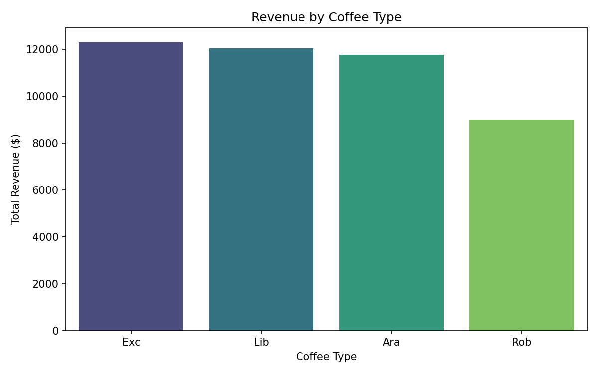
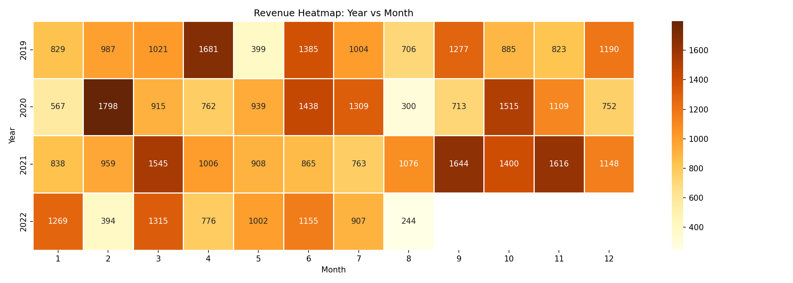

# ☕ Coffee Bean Sales Analysis

A complete end-to-end data analysis project on a specialty coffee bean company's sales data.

---

## 📌 Project Overview

| Item | Details |
|---|---|
| **Goal** | Turn raw messy data into actionable business insights |
| **Tools** | Python, Pandas, NumPy, Matplotlib, Seaborn |
| **Dataset** | 1,000 Orders · 1,000 Customers · 48 Products |
| **Period** | 2019 – 2022 |

---

## 🗺️ Project Phases

| Phase | Name | Description |
|---|---|---|
| 1 | Data Understanding | Loaded 3 tables and explored structure & relationships |
| 2 | Quality Assessment | Found missing values, duplicates, wrong types & outliers |
| 3 | Data Cleaning | Fixed all issues, merged tables, saved cleaned CSV |
| 4 | EDA | Answered 15+ business questions |
| 5 | Visualization | Built 10 professional charts |
| 6 | Final Report | Presentation with findings & recommendations |

---

## 📊 Key Findings

- 🇺🇸 **USA** is the top market by revenue
- ☕ **Liberica** = highest revenue & profit margin
- 💳 **Loyalty card holders** spend 15% more
- 📅 **Q4** consistently outperforms all other quarters
- 🏆 **Light Roast** is the most popular roast type

---

## 📁 Repository Structure

```
coffee-bean-sales-analysis/
├── Notebook/          → Jupyter Notebook (full analysis)
├── Cleaned_Data/      → Final cleaned CSV
├── Images/            → All 10 charts
├── Final_report/      → Presentation PDF
└── Raw Data/          → Original dataset
```

---

## 📈 Sample Charts




---

## 🔧 How to Run

```bash
pip install pandas numpy matplotlib seaborn openpyxl
```

Then open `Notebook/Coffee Beans Project.ipynb` in VS Code or Jupyter.
